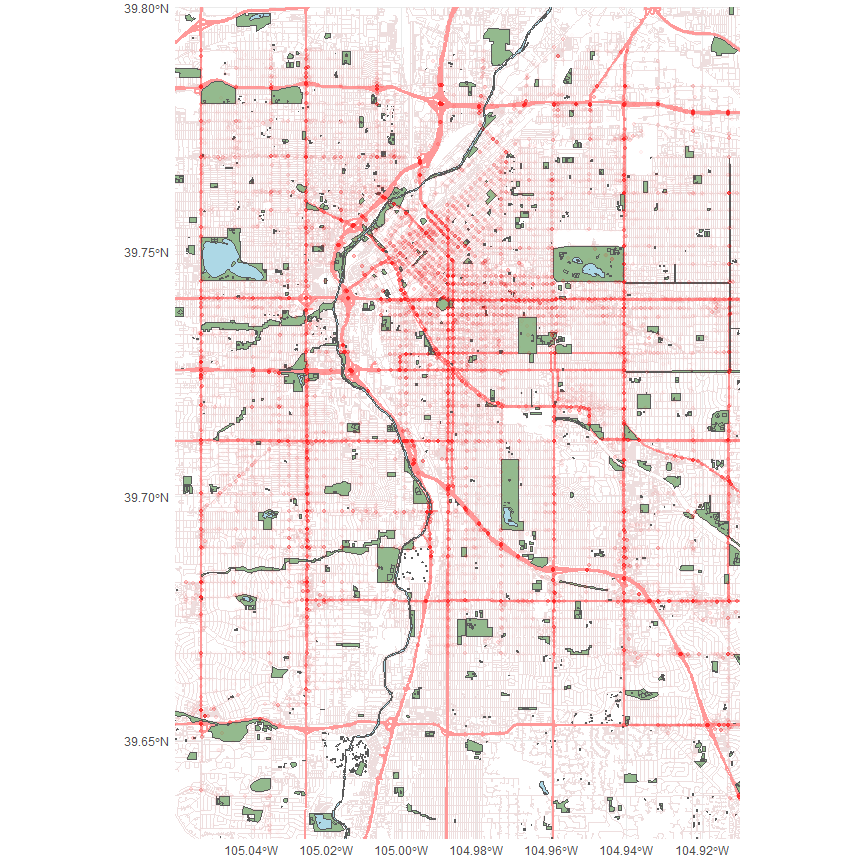

# Denver Data Maps

<div class="cell">

</div>

To create maps in R, you usually start with a shape file. This shape
file can be downloaded from a data source, or it can be loaded using one
of many R packages.

In this doc, we’ll be using two downloaded shape files from the [Denver
Open Data
Catalog](https://www.denvergov.org/opendata/ "Denver Open Data Catalog"),
overlayed on top of base map layers obtained from
[OpenStreetMap](https://wiki.openstreetmap.org/wiki/Main_Page "OpenStreetMap")

First, we’ll use the `'osmdata'` package to load in a base layer Denver
map. This is done be specifying a location object with `osmdata::opq()`
, then loading in any specific [map
features](https://wiki.openstreetmap.org/wiki/Map_Features "Map features - OpenStreetMap Wiki")
as desired. For a basic map, we’ll want two road layers, water, and
parks.

<div class="cell">

``` r
library(osmdata)

# load base denver data
xlim <- c(-105.06, -104.91)
ylim <- c(39.63, 39.80)
denver <- opq("Denver, CO")

# separate primary and secondary roads for mapping purposes
highway_tags <- 
  c(
    "motorway",
    "trunk",
    "primary",
    "motorway_junction",
    "trunk_link",
    "primary_link",
    "motorway_link"
  )
street_tags <- available_tags("highway")
street_tags <- setdiff(street_tags, highway_tags)

# remove footpath tags from streets
footpath_tags <- c("footway", "path", "steps", "cycleway")
street_tags <- setdiff(street_tags, footpath_tags)

# specific tags for parks
park_tags <- 
  c(
    "disc_golf_course",
    "garden",
    "nature_reserve",
    "park",
    "pitch",
    "playground",
    "recreation_ground",
    "garden",
    "pitch"
  )

load_osm_feature <- function(value, key, location) {
  return(osmdata_sf(add_osm_feature(location, key = key, value = value)))
}

layer_tags <- 
  list(
    "highway" = highway_tags,
    "highway" = street_tags,
    "natural" = "water",
    "leisure" = park_tags
  )

layer_names <-
  c(
    "highways",
    "streets",
    "water",
    "parks"
  )

library(purrr)
layers <- 
  layer_tags %>% 
  imap(load_osm_feature, location = denver) %>% 
  set_names(layer_names)
```

</div>

Next, we load in our data from the city of Denver. We use the `sf`
package to load the shape file.

<div class="cell">

``` r
library(sf)
# read traffic accidents data shape file from Denver gov
accident_shape <- st_read("data/shapes/traffic_accidents/traffic_accidents.shp")
```

<div class="cell-output-stdout">

    Reading layer `traffic_accidents' from data source 
      `C:\projects\denver\data\shapes\traffic_accidents\traffic_accidents.shp' 
      using driver `ESRI Shapefile'
    replacing null geometries with empty geometries
    Simple feature collection with 110470 features and 0 fields (with 3721 geometries empty)
    Geometry type: POINT
    Dimension:     XY
    Bounding box:  xmin: -105.2062 ymin: 39.61441 xmax: -104.6097 ymax: 39.90431
    Geodetic CRS:  WGS 84

</div>

</div>

Once our shape files are loaded, we can plot using `ggplot2`, using
`geom_sf()` to add each shape layer.

<div class="cell">

``` r
library(ggplot2)
denver_map <- 
  ggplot() + 
  aes(geometry = geometry) +
  geom_sf(data = layers$streets$osm_lines, size = 0.5, color = '#eedede') +
  geom_sf(data = layers$highways$osm_lines, color = '#ff9999', size = 1) + 
  geom_sf(data = layers$parks$osm_polygons, fill = '#94ba8e') +
  geom_sf(data = layers$water$osm_multipolygons, fill = 'lightblue')
```

</div>

After adding the traffic data, set the coordinates of the plot using
`coord_sf()`

<div class="cell">

``` r
denver_map + 
  geom_sf(data = accident_shape, alpha = 0.01, size = 1, color = "red") +
  coord_sf(xlim = xlim, ylim = ylim, expand = FALSE) +
  theme_minimal()
```

<div class="cell-output-display">



</div>

</div>

<br><br>
